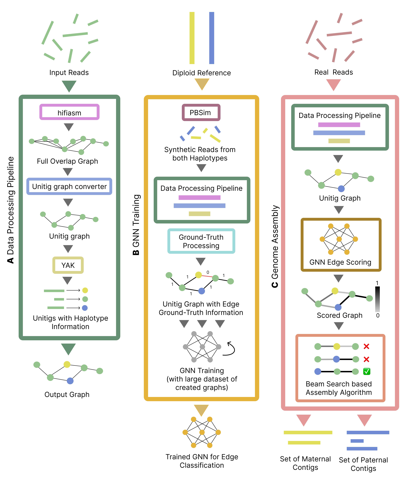

# DipGNNome

**The first deep learning–based assembler for diploid *de novo* genome assembly**

[](https://www.python.org/downloads/)
[](https://pytorch.org/)
[](https://www.dgl.ai/)

## Overview

We present **DipGNNome**, the first deep learning–based assembler for diploid *de novo* genome assembly. Our contributions are threefold:

1. **First ML-ready assembly graph pipeline**: We introduce the first publicly available pipeline for constructing machine learning–ready assembly graphs with ground-truth labels, enabling supervised training in the diploid setting.

2. **Novel assembly algorithm**: We develop an assembly algorithm that integrates model predictions with a beam search strategy to efficiently traverse long, string-like graphs with limited branching, a design that may generalize to other path-finding tasks.

3. **Competitive performance**: We show that a GNN-based assembler can achieve competitive accuracy, rivaling state-of-the-art methods while following a fundamentally different, learning-driven paradigm.

## Architecture



DipGNNome operates in three main stages:

### (A) Data Processing (`data_gen/`)
- HiFi reads are assembled into a unitig graph with **hifiasm**
- Graphs are simplified and annotated with haplotype information using trio-derived k-mers
- Creates machine learning–ready datasets with ground-truth labels

### (B) Synthetic Training (`training/`)
- Simulated diploid reads generate labeled graphs for supervised GNN training
- Edge classification models learn to predict optimal assembly paths
- Symmetric Gated Graph Convolutional Network (SymGatedGCN) architecture

### (C) Genome Assembly (`decoding/`)
- Real data are processed as in stage A
- Trained GNN scores edges for optimal path selection
- Beam search algorithm reconstructs phased maternal and paternal haplotypes

## Key Features

- 🧬 **Diploid-aware assembly**: Handles heterozygous regions and phase information
- 🤖 **Deep learning integration**: Uses Graph Neural Networks for path prediction
- ⚡ **Efficient beam search**: Optimized traversal of assembly graphs
- 🔧 **Modular design**: Separate components for data generation, training, and assembly

## Quick Start

### Prerequisites

- Python 3.8+
- Git, Make, GCC (for external tools)
- CUDA toolkit (optional, for GPU acceleration)

### Installation

Choose one of the following installation methods:

#### Option 1: Automated Installation (Recommended)
```bash
python install_tools.py
```

#### Option 2: Conda Environment Setup

**For GPU support:**
```bash
./setup_gpu.sh
```

**For CPU-only:**
```bash
./setup_cpu.sh
```

#### Option 3: Manual Installation
```bash
# Install Python dependencies
pip install -r requirements.txt

# Install external tools (see INSTALLATION.md for details)
```

### Verification

Test your installation:
```bash
# Set environment variable for macOS OpenMP conflicts
export KMP_DUPLICATE_LIB_OK=TRUE
python test_debug.py
```

## Usage

### 1. Data Generation
Generate unitig graphs with haplotype information from HiFi reads:

```bash
python data_gen/unitig_gen_data_class.py \
    --data_path /path/to/hifi/reads/ \
    --config configs/real_full.yml
```

### 2. Model Training
Train the Graph Neural Network on synthetic diploid data:

```bash
python training/train.py \
    --data_path /path/to/training/graphs/ \
    --data_config configs/dataset_full_i002c.yml \
    --device cuda:0 \
    --run_name your_experiment_name \
    --wandb your_wandb_project
```

### 3. Genome Assembly
Run diploid genome assembly using the trained model:

```bash
python decoding/main.py \
    --model /path/to/trained/model.pt \
    --ref reference_genome_name \
    --ass_out_dir /path/to/output/ \
    --filename output_prefix \
    --dataset /path/to/input/data/ \
    --strategy beam
```

### Command Line Arguments

#### Data Generation (`data_gen/unitig_gen_data_class.py`)
- `--data_path`: Path to directory containing HiFi reads
- `--config`: Configuration file specifying parameters

#### Training (`training/train.py`)
- `--data_path`: Path to training graph datasets
- `--data_config`: Dataset configuration file
- `--device`: GPU device (e.g., `cuda:0`, `cuda:6`) or `cpu`
- `--run_name`: Name for this training run
- `--wandb`: Weights & Biases project name for experiment tracking

#### Assembly (`decoding/main.py`)
- `--model`: Path to trained model checkpoint
- `--ref`: Reference genome identifier
- `--ass_out_dir`: Output directory for assembly results
- `--filename`: Prefix for output files
- `--dataset`: Path to input dataset
- `--strategy`: Assembly strategy (`beam`, `greedy`, etc.)

## Project Structure

```
DipGNNome/
├── data_gen/                 # Data processing and graph generation
│   ├── unitig_gen_data_class.py
│   └── utg_builder.py
├── training/                 # Model training and architecture
│   ├── train.py
│   ├── SymGatedGCN.py
│   └── utils.py
├── decoding/                 # Assembly and path-finding algorithms
│   ├── main.py
│   ├── inference.py
│   ├── graph_walk.py
│   └── eval.py
├── configs/                  # Configuration files
├── install_tools.py          # Installation script
├── requirements.txt          # Python dependencies
├── environment_*.yml         # Conda environments
└── setup_*.sh               # Setup scripts
```

## Dependencies

### Python Packages
- **Deep Learning**: PyTorch, DGL (Deep Graph Library)
- **Scientific Computing**: NumPy, SciPy, Pandas, Scikit-learn
- **Bioinformatics**: BioPython, Edlib, PyLiftover
- **Graph Processing**: NetworkX
- **Utilities**: tqdm, PyYAML, Wandb

### External Tools
- **hifiasm** (v0.25.0) - HiFi read assembly
- **PBSIM3** - PacBio read simulation
- **yak** - k-mer counting and analysis

## Configuration

DipGNNome uses YAML configuration files for easy customization:

- `configs/config.yml` - Main training and model parameters
- `configs/dataset_*.yml` - Dataset-specific configurations
- `decoding/decode_strategies.yml` - Assembly strategy parameters

## Performance

DipGNNome achieves comparable performance to state-of-the-art diploid assemblers. The following table compares DipGNNome (both Greedy and Beam Search variants) with hifiasm across multiple genomes:

| Genome | Metric | DipGNNome Greedy | DipGNNome Beam Search | hifiasm |
|--------|--------|------------------|----------------------|---------|
| **H. sapiens** | Length (mB) | 2840.0 / 2946.1 | 2856.4 / 2970.3 | 2938.5 / 3032.3 |
| | Rdup (%) | **0.1** / **0.1** | 0.2 / 0.3 | 0.8 / 0.2 |
| | NG50 (mB) | 35.7 / 25.7 | 63.0 / 65.2 | 56.0 / 59.4 |
| | NGA50 (mB) | 33.6 / 25.7 | 48.4 / 49.3 | **49.7** / **58.6** |
| | Switch Err (%) | 1.1 / 1.2 | 1.1 / 1.2 | **0.8** / **1.0** |
| | Hamming Err (%) | 2.2 / 2.5 | 1.9 / 3.0 | **0.8** / **0.8** |
| **P. paniscus** | Length (mB) | 3114.5 / 2934.2 | 3125.5 / 2947.4 | 3204.4 / 3066.0 |
| | Rdup (%) | 2.0 / **0.8** | 1.9 / 1.0 | **1.2** / 1.1 |
| | NG50 (mB) | 52.6 / 48.5 | 94.0 / 70.3 | 100.1 / 63.0 |
| | NGA50 (mB) | 35.2 / 39.6 | 50.1 / 42.3 | **55.2** / **47.1** |
| | Switch Err (%) | 0.3 / 1.8 | 0.3 / 1.7 | **0.2** / **1.5** |
| | Hamming Err (%) | 1.3 / 2.3 | 1.7 / 3.1 | **0.1** / **1.3** |
| **G. gorilla** | Length (mB) | 3366.2 / 3267.0 | 3389.8 / 3281.6 | 3528.4 / 3351.6 |
| | Rdup (%) | **1.1** / 1.4 | 1.2 / 1.4 | 1.2 / **1.1** |
| | NG50 (mB) | 69.0 / 44.3 | 108.1 / 100.6 | 94.7 / 82.6 |
| | NGA50 (mB) | 45.7 / 33.6 | **56.1** / **48.9** | 55.5 / 48.6 |
| | Switch Err (%) | 0.3 / **0.2** | 0.3 / **0.2** | **0.2** / 0.2 |
| | Hamming Err (%) | 1.1 / 1.0 | 1.4 / 1.0 | **0.2** / **0.2** |
| **P. troglodytes** | Length (mB) | 3056.0 / 2938.1 | 3080.7 / 2956.3 | 3149.0 / 3032.9 |
| | Rdup (%) | **0.1** / **0.1** | 0.5 / 0.2 | **0.1** / **0.1** |
| | NG50 (mB) | 72.1 / 74.8 | 136.8 / 136.6 | 126.0 / 121.9 |
| | NGA50 (mB) | 62.2 / 68.0 | **102.8** / 76.1 | 101.9 / **121.9** |
| | Switch Err (%) | **0.1** / **0.2** | **0.1** / **0.2** | **0.1** / **0.2** |
| | Hamming Err (%) | 0.3 / 0.4 | 0.7 / 1.3 | **0.1** / **0.1** |
| **S. syndactylus** | Length (mB) | 3131.6 / 3029.6 | 3133.5 / 3038.1 | 3230.0 / 3127.6 |
| | Rdup (%) | 0.2 / **0.1** | 0.3 / 0.3 | **0.1** / 0.7 |
| | NG50 (mB) | 67.6 / 50.7 | 90.8 / 69.6 | 84.9 / 75.4 |
| | NGA50 (mB) | 55.4 / 45.8 | 56.1 / **58.6** | **76.1** / 38.7 |
| | Switch Err (%) | **0.1** / **0.2** | **0.1** / **0.2** | **0.1** / **0.2** |
| | Hamming Err (%) | 0.3 / 0.4 | 0.5 / 0.6 | **0.1** / **0.1** |
| **P. abelii** | Length (mB) | 3297.8 / 3487.0 | 3332.7 / 3522.1 | 2967.5 / 3361.0 |
| | Rdup (%) | 10.5 / 12.7 | 11.1 / 13.6 | **2.3** / **7.5** |
| | NG50 (mB) | 55.9 / 53.7 | 79.8 / 80.8 | 40.1 / 94.2 |
| | NGA50 (mB) | 43.0 / 40.6 | **45.7** / 57.5 | 34.1 / **65.3** |
| | Switch Err (%) | 6.5 / 4.6 | 6.5 / 4.6 | **4.8** / **3.8** |
| | Hamming Err (%) | 6.3 / 4.4 | 6.7 / 4.4 | **5.0** / **3.8** |
| **P. pygmaeus** | Length (mB) | 3166.4 / 3272.6 | 3176.3 / 3304.0 | 3092.5 / 3212.2 |
| | Rdup (%) | 5.8 / **5.8** | 6.2 / 6.4 | **2.7** / 6.5 |
| | NG50 (mB) | 51.8 / 52.5 | 108.2 / 100.9 | 65.8 / 85.0 |
| | NGA50 (mB) | 45.6 / 51.6 | **78.9** / **92.2** | 55.7 / 47.4 |
| | Switch Err (%) | 7.3 / 8.9 | 7.2 / 8.8 | **6.9** / **8.7** |
| | Hamming Err (%) | 7.7 / 9.6 | **7.5** / **9.0** | 7.8 / 10.7 |

**Key Performance Highlights:**
- **Accuracy**: Rivals traditional assembly methods across multiple genomes
- **Efficiency**: Optimized beam search for large graphs
- **Scalability**: Handles diploid genomes with complex heterozygosity patterns
- **Competitive Results**: Shows strong performance in NG50, NGA50, and error metrics
- **Bold values** indicate the best performance for each metric

*Note: Values are shown as paternal/maternal haplotypes.*

## Citation

If you use DipGNNome in your research, please cite:

```bibtex
To be made citable..
```

## License

This project is licensed under the MIT License - see the LICENSE file for details.

## Support

For installation issues, see [INSTALLATION.md](INSTALLATION.md) for detailed troubleshooting.

For questions about usage or methodology, please open an issue on GitHub.

## Acknowledgments

- Built on top of [hifiasm](https://github.com/chhylp123/hifiasm) for initial assembly
- Uses [DGL](https://www.dgl.ai/) for graph neural network operations
- Inspired by advances in graph-based genome assembly and deep learning

---

**DipGNNome** - Pioneering the future of diploid genome assembly through deep learning.